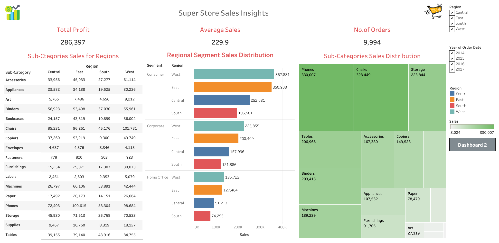
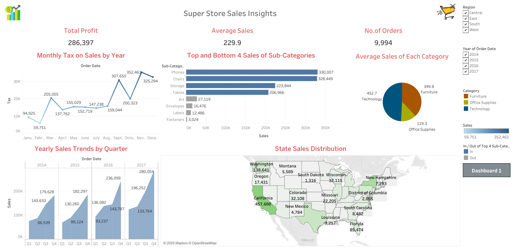

# Super Store Sales Insights - Tableau Dashboard
A comprehensive **Tableau** dashboard built on the classic **Superstore** sample dataset. This project provides interactive sales and profit analysis for a fictional retail company, with insights into regional performance, product sub-categories, customer segments, quarterly trends, and geographic distribution.

## Project Overview
The Superstore dataset is a widely used sample dataset provided by Tableau, containing sales, profit, and order data across various regions, categories, and time periods (2014–2017). This repository showcases a multi-sheet Tableau workbook organized into two polished dashboards:

- **Dashboard 1**: High-level trends and geographic insights
- **Dashboard 2**: Detailed regional and sub-category breakdowns

All visuals were built as individual worksheets first, then carefully arranged and synchronized using dashboard actions, filters, and layout containers for an interactive experience.

## Key Metrics (Overall)
- **Total Profit**: $286,397
- **Average Sales**: $229.9
- **Number of Orders**: 9,994

## Dashboards & Worksheets

### Dashboard 1: Trends & Geography
- Monthly Tax on Sales by Year (line chart with peaks highlighted)
- Yearly Sales Trends by Quarter (column chart)
- State Sales Distribution (filled map with top states highlighted)
- Top and Bottom 4 Sub-Categories by Sales (horizontal bar chart)
- Average Sales of Each Category (pie chart)

---

### Dashboard 2: Regional & Sub-Category Deep Dive
- Sub-Categories Sales for Regions (matrix table with conditional formatting)
- Regional Segment Sales Distribution (stacked bar chart by Consumer, Corporate, Home Office)
- Sub-Categories Sales Distribution (treemap)

---

Interactive filters:
- Region (multi-select: Central, East, South, West)
- Year of Order Date (2014–2017)

## Worksheets Included
The workbook contains the following individual sheets (combined into dashboards):
- Top_Bottom_4_SubCategories
- Average_Sales_Category
- Total_Profit
- No_of_Orders
- Sub_Categories_Sales_Regions
- Regional_Segment_Sales
- Yearly_Quarter_Trends
- State_Sales
- Monthly_Tax_Sales

## Technologies Used
- **Tableau Desktop** (or Tableau Public) – for data connection, calculations, visualizations, and dashboard design
- Superstore sample dataset (built-in with Tableau)

## How to Use
1. Download the Tableau workbook file (`.twb` or `.twbx`) if uploaded to the repository.
2. Open in Tableau Desktop or Tableau Public.
3. Interact with the filters (Region, Year) to explore different views.

This project is an excellent example of Tableau best practices: worksheet organization, dashboard layout, use of actions/filters, and effective storytelling with data.
